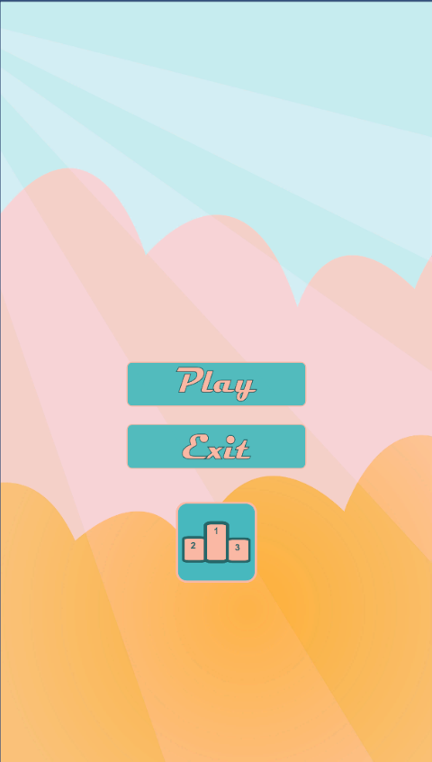

# sand-drill-wish

# Sand Drill Wish (Card Match Game Prototype)

A prototype card-matching game developed in **Unity 2021 LTS**, based on the given requirements.

## 🧩 Game Overview

This is a memory card-matching game where players flip cards to find matching pairs. It includes support for multiple layouts, saving progress, scoring, and sound effects.

## 🛠️ Tech Stack

- Unity 2021 LTS
- C#
- Target Platforms: **iOS** and **Desktop**

## ✅ Features Implemented

- 🔄 Card flip animation
- 🔊 Sound effects for flip, match, no match, game over
- 💾 Save/load system with `PlayerPrefs`
- 🎯 Scoring system with combo streak bonus
- 🕹️ Timer
- 📱 Scalable UI for multiple screen sizes
- 💡 Game states with visual feedback
- 📊 Leaderboard with best score and best time

## 📷 Screenshots

### 🏠 Main Menu


### 🎮 Set Game Screen


### 🏆 Leaderboard


### 🛑 Game End Panel


## 🚀 How to Run

1. Clone this repository  
   ```bash
   git clone https://github.com/kallukhaleel/sand-drill-wish.git
